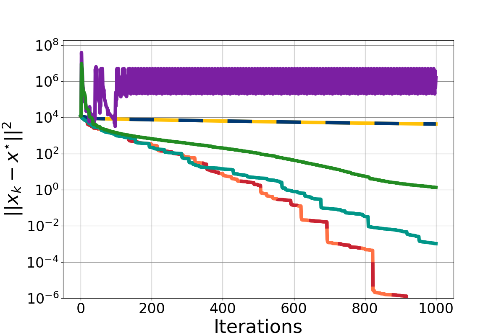
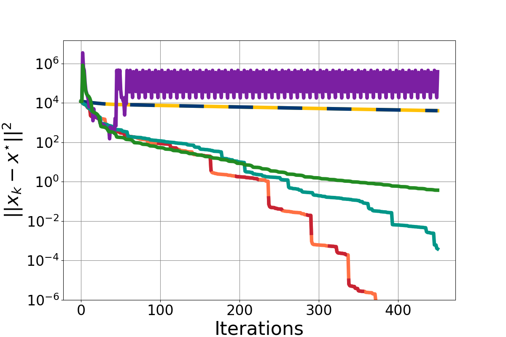
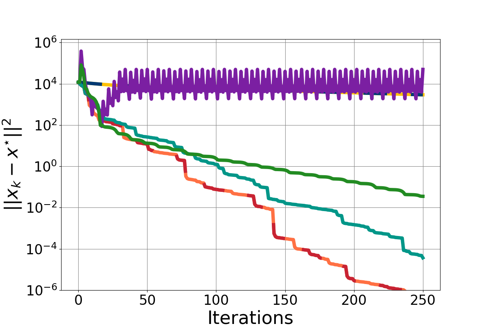
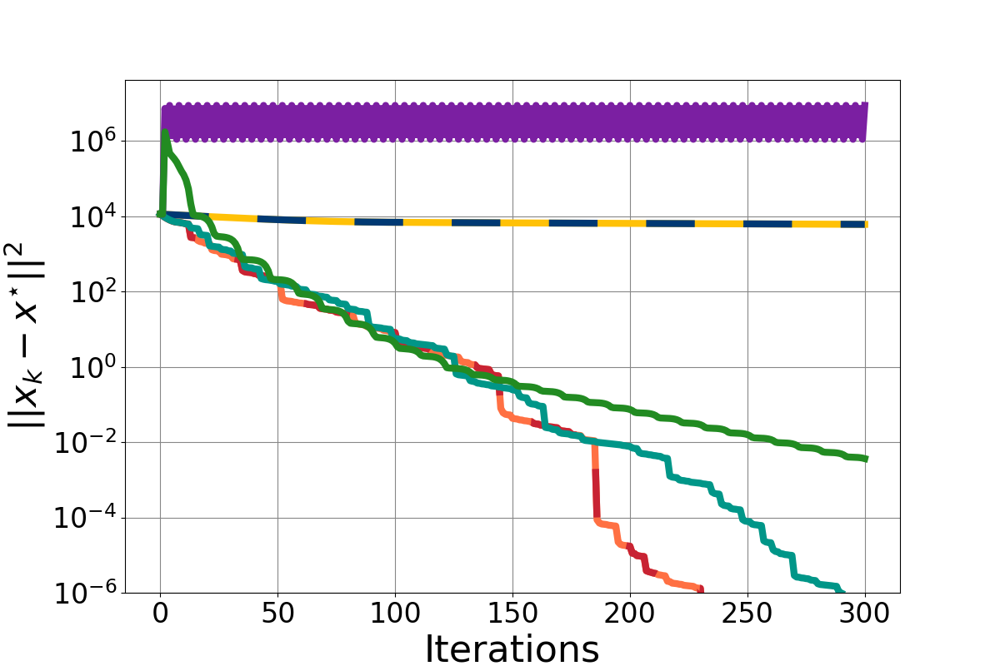
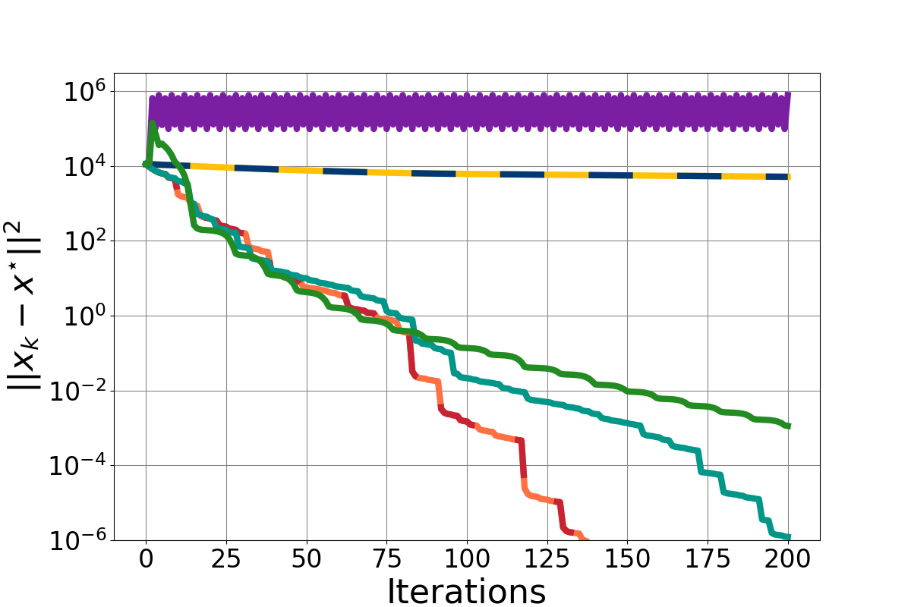
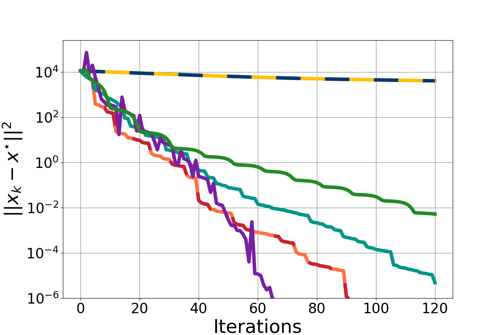
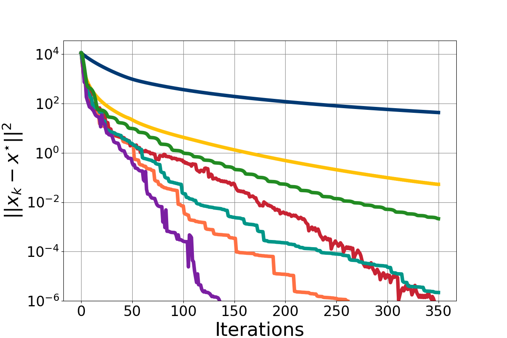
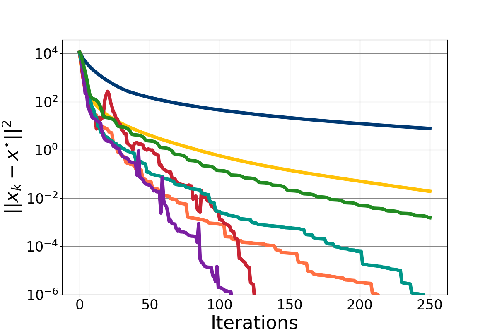
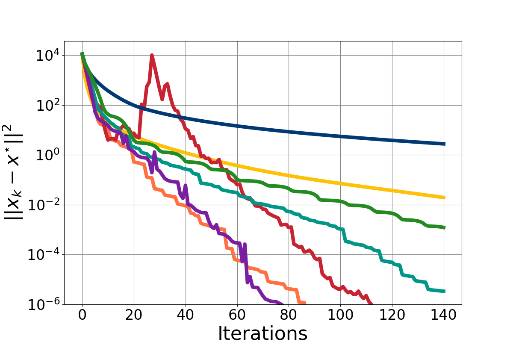

## Logistic regression on a2a dataset with L2 Regularization

| **$\lambda = L \cdot 10^{-4}$** | **$\lambda = \frac{L}{3} \cdot 10^{-3}$** | **$\lambda = L \cdot 10^{-3}$** |
|:----------------------------:|:----------------------------:|:----------------------------:|
|   |    |    |

  
---
  

## Logistic regression on mushrooms dataset with L2 Regularization

| **$\lambda = L \cdot 10^{-4}$** | **$\lambda = \frac{L}{3} \cdot 10^{-3}$** | **$\lambda = L \cdot 10^{-3}$** |
|:----------------------------:|:----------------------------:|:----------------------------:|
|  |  |  |

                                       
---
  

## Logistic regression on mushrooms dataset with L3 Regularization

| **$\lambda = L \cdot 10^{-3}$** | **$\lambda = \frac{L}{3} \cdot 10^{-2}$** | **$\lambda = L \cdot 10^{-2}$** |
|:----------------------------:|:----------------------------:|:----------------------------:|
|  |  |  |

  
